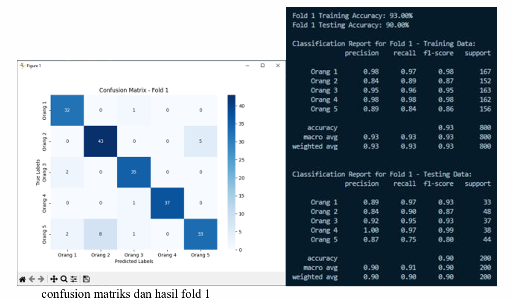
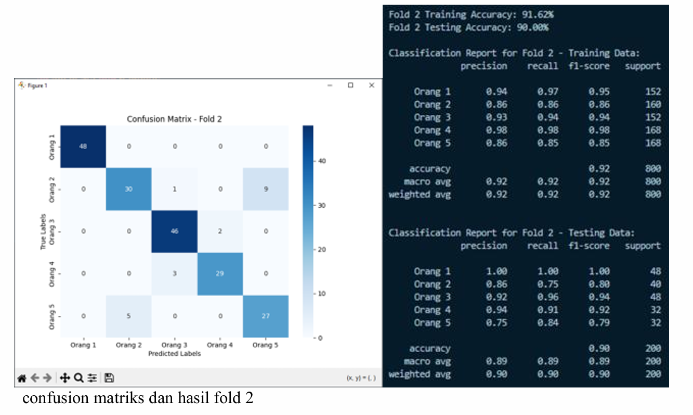
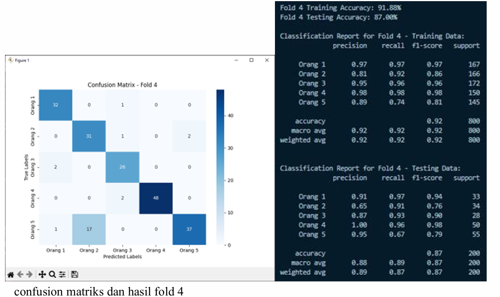
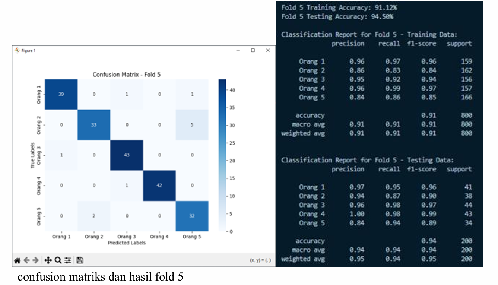
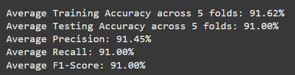

# Analisis Dorsal Hand Vein dengan Backpropagation Neural Network (BPNN)

Proyek ini bertujuan untuk mengembangkan sistem autentikasi pengguna berbasis citra pembuluh darah dorsal tangan dengan menggunakan algoritma **Backpropagation Neural Network (BPNN)** yang dievaluasi menggunakan teknik **K-Fold Cross Validation**.

---

## Tools & Teknologi
- Python (Google Colab & Visual Studio Code)
- Pandas, NumPy
- TensorFlow / Keras
- Scikit-learn
- Matplotlib, Seaborn

---

## Alur Proyek
1. Load dan preprocessing dataset citra dorsal hand vein
2. Standardisasi fitur dan encoding label
3. Implementasi Neural Network menggunakan Keras
4. Evaluasi performa model dengan 5-Fold Cross Validation
5. Visualisasi Confusion Matrix dan metrik evaluasi lainnya

---

## Hasil Evaluasi Model
Hasil penelitian menunjukkan bahwa model BPNN mampu memberikan performa yang baik dengan ratarata akurasi sebesar 90,36%, selisih antara akurasi pelatihan dan pengujian yang kecil (1,32%) menunjukkan bahwa model berada dalam kondisi ideal tanpa mengalami overfitting. Sensitivitas dan spesifisitas yang tinggi pada beberapa fold membuktikan bahwa sistem ini efektif dalam mengenali pola pembuluh darah dorsal tangan dengan akurat.

## Visualisasi

